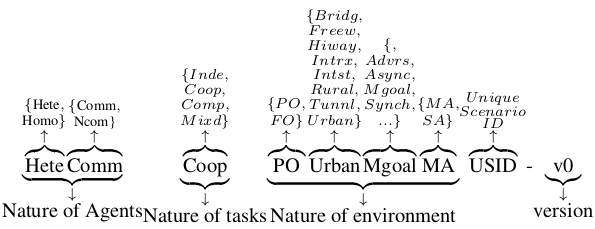

# README

## 运行环境

环境搭建参考[MAD-ARL](https://github.com/T3AS/MAD-ARL) 和 [macad-gym](https://github.com/praveen-palanisamy/macad-gym), 具体有些包的版本需要修改，以下是可运行环境的的相关包版本：
```bash
(MAD-ARL) ➜  MAD-ARL git:(master) ✗ pip list
Package                Version      Editable project location
---------------------- ------------ -------------------------------
absl-py                1.4.0
aiohttp                3.8.6
aiosignal              1.2.0
ale-py                 0.7.1
astor                  0.8.1
async-timeout          4.0.2
asynctest              0.13.0
atari-py               0.2.9
attrs                  22.2.0
beautifulsoup4         4.12.2
cached-property        1.5.2
cachetools             4.2.4
carla                  0.9.13
certifi                2018.11.29
charset-normalizer     2.0.12
click                  8.0.4
cloudpickle            2.2.1
colorama               0.4.5
dataclasses            0.8
decorator              4.4.2
dm-tree                0.1.8
filelock               3.4.1
frozenlist             1.2.0
gast                   0.2.2
google                 3.0.0
google-auth            1.35.0
google-auth-oauthlib   0.4.6
google-pasta           0.2.0
GPUtil                 1.4.0
grpcio                 1.48.2
gym                    0.12.1
gym-notices            0.0.8
h5py                   3.1.0
idna                   3.6
idna-ssl               1.1.0
importlib-metadata     4.8.3
importlib-resources    5.4.0
jsonschema             3.2.0
Keras-Applications     1.0.8
Keras-Preprocessing    1.1.2
lz4                    3.1.10
macad-gym              0.1.3        $workdir/src
Markdown               3.3.7
mkl-fft                1.0.6
mkl-random             1.0.1
multidict              5.2.0
networkx               2.5.1
numpy                  1.19.5
oauthlib               3.2.2
opencv-python          3.4.2.17         
opencv-python-headless 4.2.0.34         
opt-einsum             3.3.0
packaging              21.3
pandas                 1.1.5
pip                    21.3.1
protobuf               4.21.0
py-spy                 0.3.14
pyasn1                 0.5.1
pyasn1-modules         0.3.0
pygame                 2.5.2
pyglet                 2.0.10
pyparsing              3.0.7
pyrsistent             0.18.0
python-dateutil        2.8.2
pytz                   2023.3.post1
PyYAML                 6.0.1
ray                    0.8.4
redis                  4.3.6
requests               2.27.1
requests-oauthlib      1.3.1
rsa                    4.9
scipy                  1.4.1
setuptools             59.6.0
six                    1.16.0
soupsieve              2.3.2.post1
tabulate               0.8.10
TBB                    0.2
tensorboard            2.1.1
tensorboardX           2.1
tensorflow             2.1.0
tensorflow-estimator   2.1.0
tensorflow-gpu         2.1.0
termcolor              1.1.0
tf-slim                1.1.0
typing_extensions      4.1.1
urllib3                1.26.18
Werkzeug               2.0.3
wheel                  0.37.1
wrapt                  1.16.0
yarl                   1.7.2
zipp                   3.6.0
```
 
python 版本是3.6， 其中 `opencv-python`和`opencv-python-headless`尽量和上面一致


## macad-gym 环境命名
命名参考：




**Nature of agent:**
- Hete: Heterogeneous, 不同类型的Agent
- Homo: Homogeneous, 同类型的Agent
- Comm: Communicating, Agent 之间可以相互通讯
- Ncom: Non-communicating, Agent 之间不可以相互通讯

**Nature of tasks:**
- Independent
- Cooperative
- Competitive
- Mixed

**Nature of environments:**
- Full/partial observability
- Synchronous/Asynchronous
- Adversarial


## Debug

MAD-ARL carla serve run with arguments: 
```python
['/home/dell/qqw/software/carla_9.13/CarlaUE4.sh', 
'/Game/Carla/Maps/Town03', 
 '-windowed', 
 '-ResX=', '800', 
 '-ResY=', '600', 
 '-benchmark -fps=20', 
 '-carla-server', 
 '-carla-world-port=37935 -carla-streaming-port=0'
 ]
```

macad-gym carla server run arguments:
```python
['/home/dell/qqw/software/carla_9.13/CarlaUE4.sh', 
 '-windowed', 
 '-ResX=', '800', 
 '-ResY=', '600', 
 '-benchmark', 
 '-fps=20', 
 '-carla-server', 
 '-carla-rpc-port=50697', 
 '-carla-streaming-port=0']
```

### ISSUES
MAD-ARL 虚拟环境，carla_0.9.13


#### 客户端无法连接服务端
MAD-ARL的工程项目的`examples` 下的示例和 macad-gym提供的 `examples/basic_agent.py` 示例  
运行过程都会在 `src/macad_gym/carla/multi_env.py:MultiCarlaEnv._init_server()` 函数卡死  
下面是卡死的代码：
```python
self._client = None
while self._client is None:
    try:
        self._client = carla.Client("localhost", self._server_port)
        self._client.set_timeout(2.0)
        self._client.get_server_version()
    except RuntimeError as re:
        if "timeout" not in str(re) and "time-out" not in str(re):
            print("Could not connect to Carla server because:", re)
        self._client = None
self._client.set_timeout(60.0)
```
上面的代码主要是连接carla的服务端，在 `self._client.get_server_version()` 中提示超时  
但是服务端确实启动了。  


在MAD-ARL的虚拟环境中运行macad-gym，可以正常运行。  
原因分析： MAD-ARL项目底层使用了macad-gym的环境搭建，但是修改过macad-gym的环境创建的参数
导致客户端无法连接服务端


#### 智能体的配置参数

在 `src/macad_gym/envs/homo/ncom/inde/po/intrx/ma/stop_sign_3c_town03.py` 有不同阶段的Agent行为配置参数。  
不同阶段的Agent参数已被注释，是否需要在运行不同阶段的代码，打开不同的配置。


